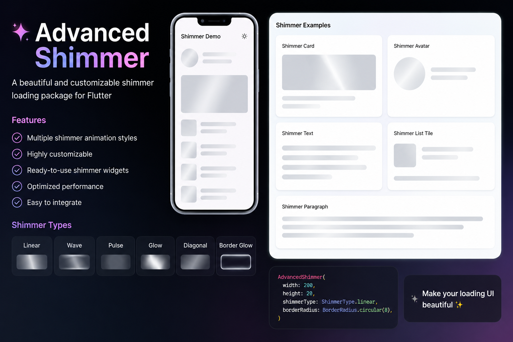

# Advanced Shimmer

A beautiful, customizable Flutter shimmer loading package with multiple shimmer animation styles and ready-made shimmer widgets for skeleton loading UIs.

Flutter Platform License


---

## ✨ Features

- ✨ Beautiful shimmer loading effects
- 🎨 Multiple shimmer animation styles
- ⚡ Smooth animated shimmer
- 🧩 Ready-made shimmer widgets
- 🔲 Shimmer Card
- 🔤 Shimmer Text
- 👤 Shimmer Avatar
- 📋 Shimmer List Tile
- 🎛 Fully customizable colors
- ⏱ Custom animation duration
- 📱 Android, iOS, Web support
- 🚀 Easy integration

---

## 🎬 Preview



---

## 🎨 Available Shimmer Types

- `linear`
- `wave`
- `pulse`
- `glow`
- `diagonal`
- `borderGlow`

---

## 📦 Installation

Add dependency in `pubspec.yaml`

```yaml
dependencies:
  advanced_shimmer: ^1.0.0
```

Run:

```bash
flutter pub get
```

---

## 🧩 Full Example

```dart
import 'package:flutter/material.dart';
import 'package:advanced_shimmer/advanced_shimmer.dart';

class DemoScreen extends StatelessWidget {
  const DemoScreen({super.key});

  @override
  Widget build(BuildContext context) {
    return Scaffold(
      appBar: AppBar(
        title: const Text("Advanced Shimmer Demo"),
      ),
      body: Padding(
        padding: const EdgeInsets.all(20),
        child: Column(
          children: const [
            ShimmerText(),
            SizedBox(height: 20),
            ShimmerAvatar(),
            SizedBox(height: 20),
            ShimmerCard(),
            SizedBox(height: 20),
            ShimmerListTile(),
          ],
        ),
      ),
    );
  }
}
```

---

## ⚙ Available Properties

### AdvancedShimmer

| Property | Type | Default | Description |
|----------|------|---------|-------------|
| width | double | required | Widget width |
| height | double | required | Widget height |
| baseColor | Color | grey | Base shimmer color |
| highlightColor | Color | light grey | Highlight shimmer color |
| shape | BoxShape | rectangle | Shape type |
| borderRadius | BorderRadius? | null | Border radius |
| duration | Duration | 2 sec | Animation duration |
| type | ShimmerType | linear | Shimmer animation type |

---

## 🧩 Ready-made Widgets

### ShimmerCard

Beautiful shimmer card placeholder.

```dart
ShimmerCard()
```

### ShimmerText

Text loading shimmer.

```dart
ShimmerText()
```

### ShimmerAvatar

Circular avatar shimmer.

```dart
ShimmerAvatar()
```

### ShimmerListTile

ListTile style shimmer.

```dart
ShimmerListTile()
```

---

## 📱 Platform Support

| Platform | Support |
|----------|---------|
| Android | ✅ |
| iOS | ✅ |
| Web | ✅ |
| macOS | ✅ |
| Windows | ✅ |

---

## 📄 License

MIT License

---

## 🤝 Contributing

Pull requests are welcome.

If you find bugs or want improvements, feel free to open an issue.

---

## ⭐ Support

If you like this package, give it a star on GitHub.